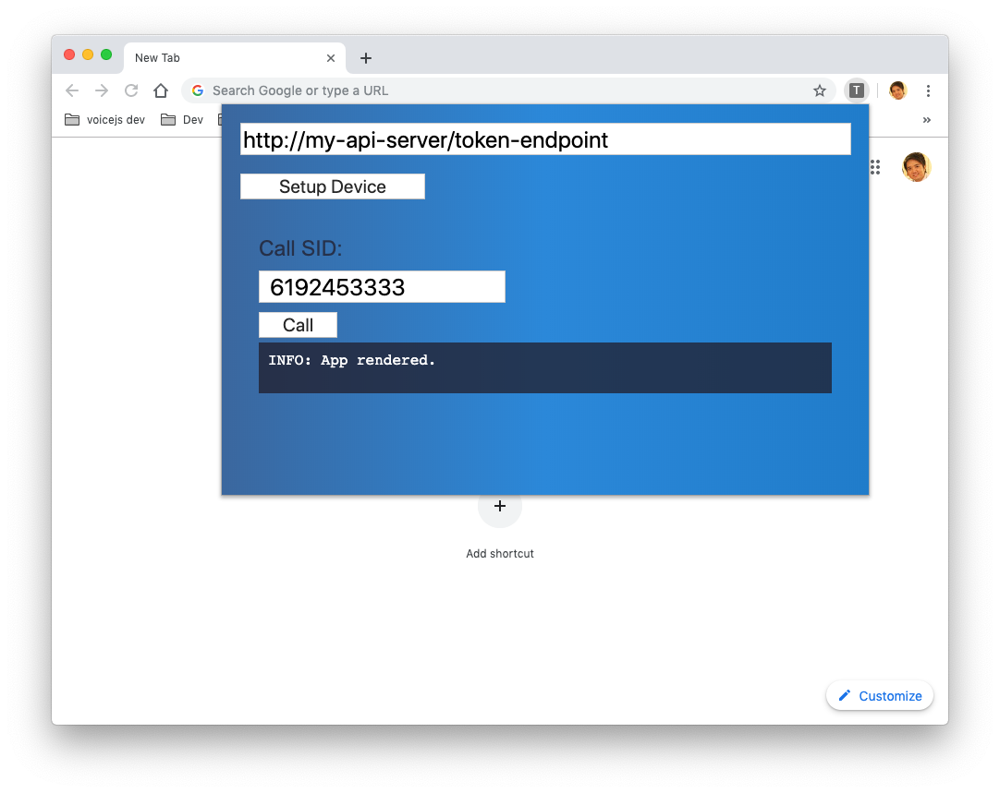

# twilio-voice-extension

Testing twilio-client.js as a chrome extension



## Installation
1. Clone this repository.
2. Install to chrome browser per instructions outlined here https://developer.chrome.com/extensions/getstarted

## Getting Tokens
This extension requires a token url (as shown in the above UI). This url should be a `GET` REST API which returns your token and identity. This token will be used to initialize the `Device` object.

Example Response from the url:
```
  {
    "token": "eyJhbGciOiJIUz....",
    "identity": "myIdentity1"
  }
```

## Making a Call
1. Enter a phone number
2. Click `Call` button

## Receiving a Call
1. Click `Setup Device` or make sure an initial outgoing call has been made.
2. Call the phone number associated with the identity used when a token was generated.
